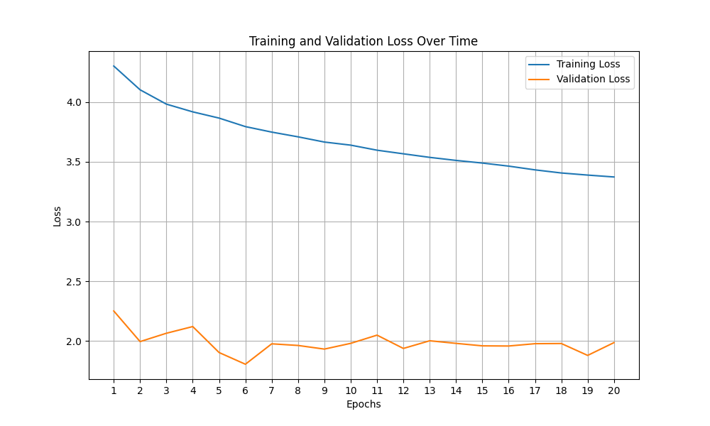
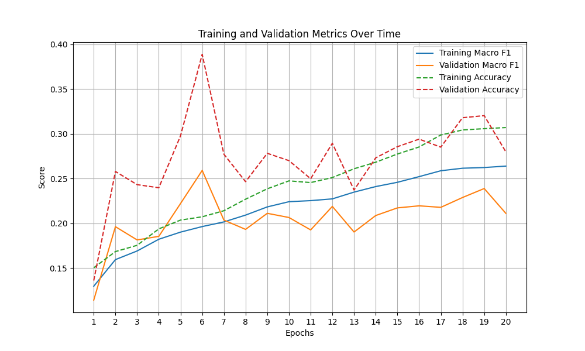
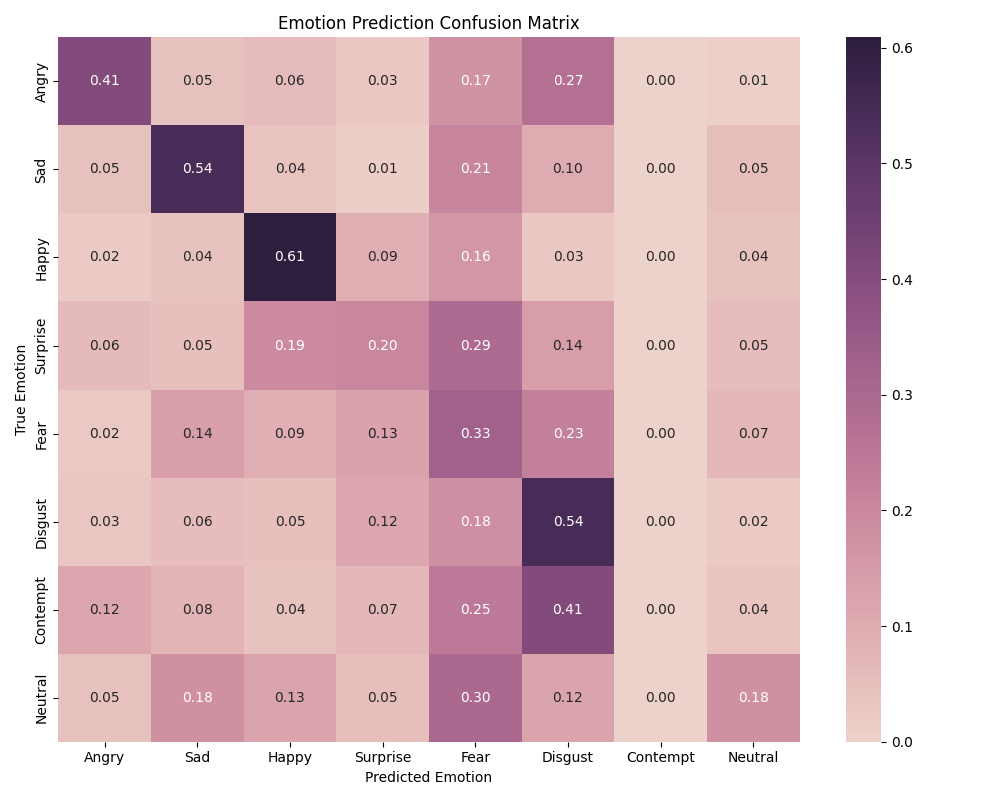

# Training Report

## Model Information
- Total Parameters: 20,287,256
- Total Training Time: 1h14m
- Batch Size: 16
- Learning Rate: 0.001
- Number of Epochs: 20

## Performance Metrics
### Training
- Macro F1 Score: 0.264
- Accuracy: 0.307

### Validation  
- Macro F1 Score: 0.211
- Accuracy: 0.280

## Visualizations
### Loss Curves

### Performance Metrics

### Confusion Matrix

        