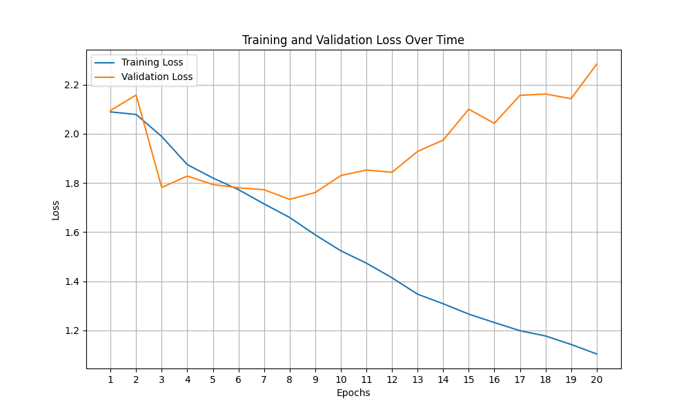
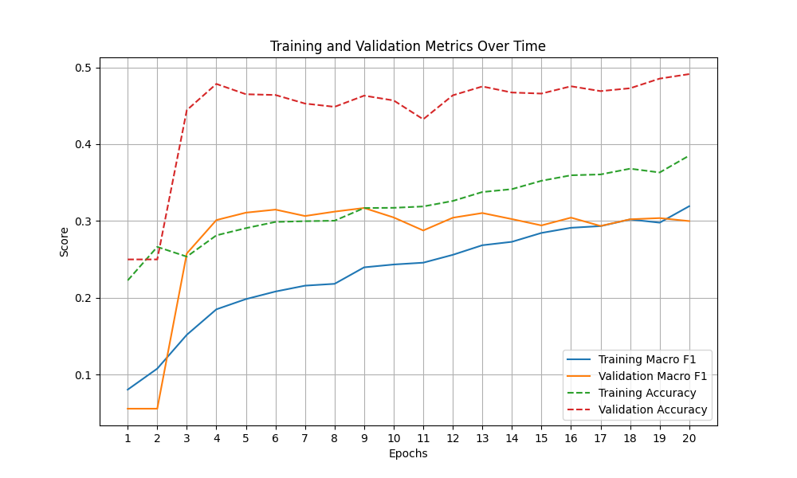
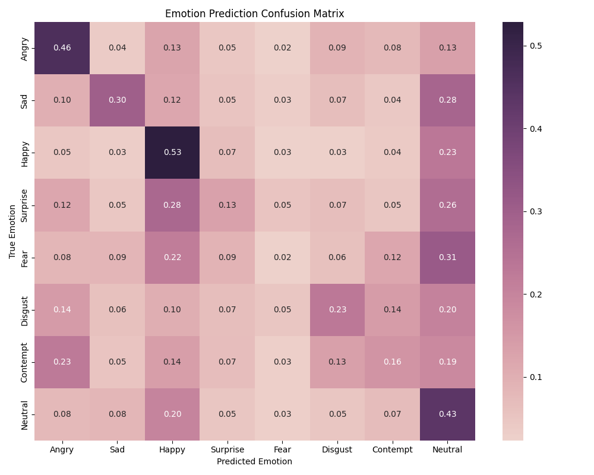

# Training Report

## Model Information
- Total Parameters: 62,580,744
- Total Training Time: 19m14s

## Performance Metrics
### Training
- Macro F1 Score: 0.319
- Accuracy: 0.385

### Validation  
- Macro F1 Score: 0.300
- Accuracy: 0.491

## Visualizations
### Loss Curves

### Performance Metrics

### Confusion Matrix

        